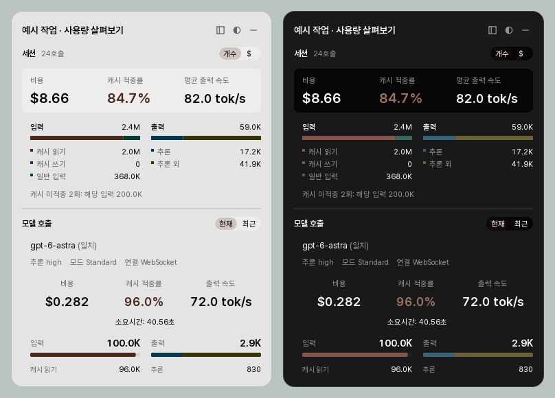
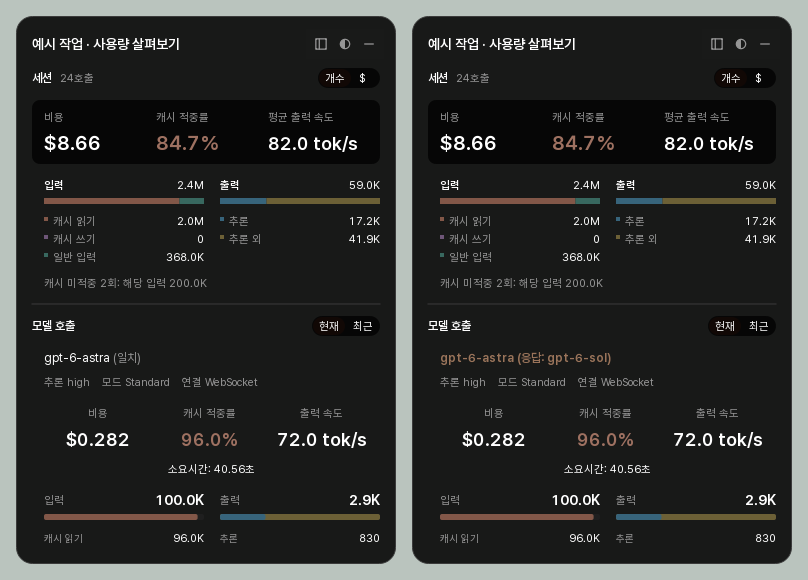
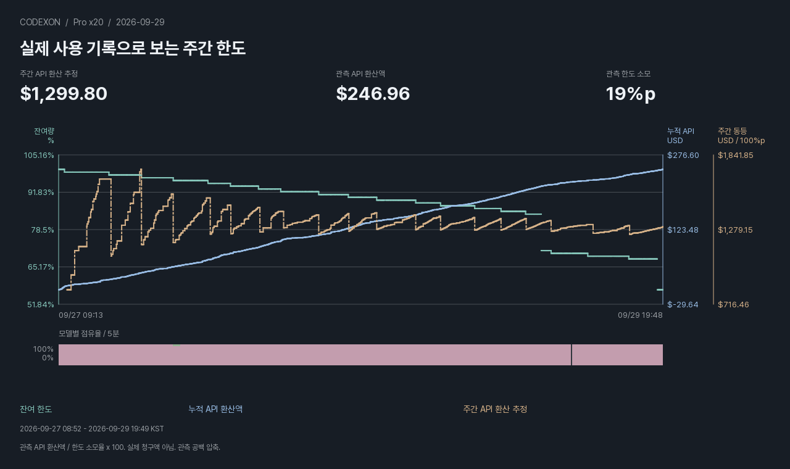
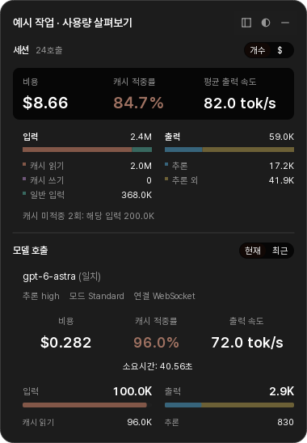
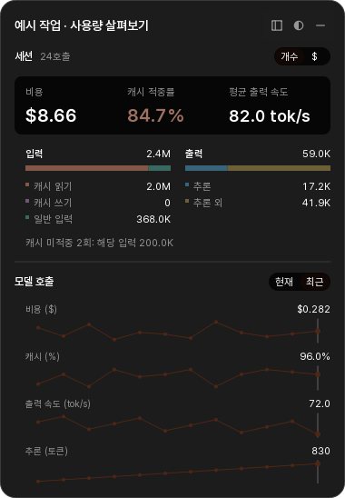
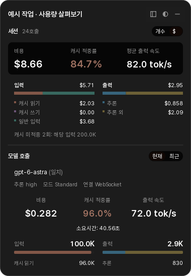
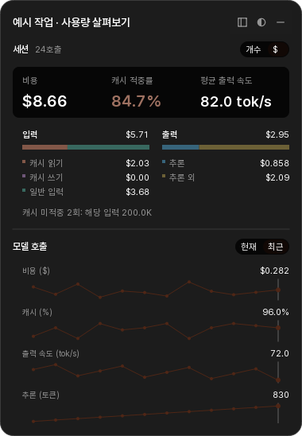
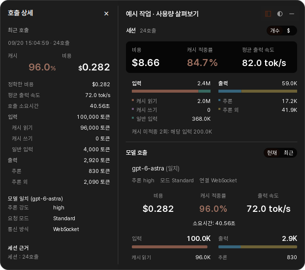

# CODEX·ON

[English](README.md) · [한국어](README.ko.md)

**Codexon은 Codex의 사용량과 캐시를 분석하고, 요청과 응답 모델명 비교를 제공하는 Windows 앱입니다. 작업 중에는 Codex 창 위의 오버레이로 사용량을 확인할 수 있습니다.**

동일한 샘플 세션을 라이트·다크 테마로 렌더링한 화면입니다.

- **호출 모델과 응답 모델의 불일치를 오버레이에서 바로 확인합니다.** 라우팅을 점검할 때 해당 호출의 요청 모델명과 응답 모델명을 나란히 살펴볼 수 있습니다.
- 작업 중 최근 호출의 토큰, 캐시율, 구독 가치 환산액을 오버레이에서 확인합니다.
- 세션에서 개별 호출까지 살펴보고, 확인된 하위 작업의 사용량을 세션 합계에 포함합니다.
- 모델·추론 수준·서비스 등급별 사용량을 비교하고, 각 결과에 포함된 호출을 살펴봅니다.
- 남은 사용량과 초기화 시각을 확인합니다. 대시보드를 닫아도 트레이와 작업표시줄 위젯에서 잔여량을 볼 수 있습니다.

금액은 **구독 가치 환산액**입니다. Standard 기준 토큰 단가에 구독 소모 배율을 적용하며, Fast는 같은 토큰 Standard 대비 2.5배입니다. [환산 기준](https://learn.chatgpt.com/docs/agent-configuration/speed). 모델 관찰은 요청/응답에 기록된 모델명을 비교합니다. 실시간 한도 조회는 설치된 Codex의 app-server와 계정 연결을 사용합니다.

설치 대상은 **Windows 10/11 x64**입니다. Python·Qt와 독립 연결 복구 도구가 설치 파일에 포함됩니다. Codex 계정 연결을 이용하며, Codexon을 위해 별도의 API 키를 발급할 필요는 없습니다.

## 호출 모델과 응답 모델이 다르다면

**선택한 모델과 응답에 기록된 모델이 같은지, 오버레이에서 확인하세요.** 이름이 다르면 해당 줄을 강조하고 `(응답: gpt-6-sol)`처럼 응답 모델명을 표시합니다. 같으면 요청 모델명 옆에 `(일치)`를 표시합니다.

라우팅을 점검할 때는 이 차이를 단서로 **호출 상세**에서 해당 기록을 확인할 수 있습니다. 비교 대상은 요청과 응답에 기록된 모델명이며, 내부 라우팅 경로나 실제 모델 구현을 확정하는 정보는 아닙니다. 위 이미지는 불일치 표시를 보여 주는 가상 샘플입니다.

## 실제 기록으로 보는 주간 사용 한도

**이전 기준 예시: 9월 29일 Pro x20 주간 할당량 환산 추정액은 약 $1,300입니다.**

아래 수치와 이미지는 구독 Fast 2.5배 변경 이전 API 단가 기준 자료입니다. 2026년 9월 29일 19:49 KST 기준 실제 로컬 기록을 앱의 차트 렌더러로 그렸습니다. 현재 주기의 로컬 관측 구간에서 API 환산액 **$246.96**, 한도 소모 **19%p**를 확인했으며, 주간 100% 기준 추정액은 **$1,299.80**입니다. 계정 전체 잔여량과 로컬 관측 구간의 소모량은 범위가 다르며, 차트는 관측 공백을 압축해 표시합니다.

## 오버레이 보기

`개수 / $`로 세션의 토큰 수량 구성과 구독 가치 환산액 구성을 전환합니다. **현재 / 최근**으로 마지막 확인 호출과 최근 12호출의 추이를 전환합니다. 어느 화면에서도 상단의 세션 합계를 함께 볼 수 있습니다.

| 현재 호출 | 최근 호출 추이 |
| --- | --- |
| **토큰 개수**  | **토큰 개수**  |
| **구독 가치 환산액**  | **구독 가치 환산액**  |

이미지를 열면 원래 크기로 확인할 수 있습니다.

헤더의 **상세 열기** 버튼을 누르면 오버레이에 호출 상세가 열립니다. 최근 화면에서는 그래프에서 호출을 먼저 선택해 해당 기록을 살펴볼 수 있습니다. 상세 패널의 **호출 상세**를 누르면 대시보드의 전체 기록으로 이동합니다.

헤더 버튼으로 배경 투명도를 조절하거나 오버레이를 최소화합니다. 최소화 아이콘을 누르면 다시 펼쳐집니다. 오버레이 이미지는 가상 샘플 데이터를 앱에서 렌더링한 화면입니다. 기존 캡처는 Fast 2.5배 변경 이전 자료입니다. 금액은 Standard 기준 단가와 Fast 2.5배를 적용한 구독 가치 환산액이며, 모델 비교는 요청과 응답에 기록된 이름을 비교한 결과입니다.

## 시작하기

**AI와 함께 설치·설정을 확인하려면** 이 저장소 링크를 주고 [AI / LLM 전용 설치 안내](INSTALL.md)를 따르도록 요청하세요. AI가 안내한 Setup을 직접 실행해 설치한 뒤 완료했다고 알려주면, AI가 설치 상태와 실행 환경·설정을 검증합니다.

1. [Releases](https://github.com/jisoq/Codexon/releases)에서 `Codexon-Setup.exe`를 받습니다.
2. 설치 프로그램을 실행합니다. 관리자 권한이나 별도 Python 설치가 필요하지 않습니다.
3. 시작 메뉴에서 **Codexon**을 엽니다. 로그인 후에도 자동 실행하려면 **설정 → 일반 → Windows 로그인 시 시작**을 켭니다.

앱 내부 업데이트·시작 메뉴 등록·제거 기능을 갖춘 설치형으로 배포합니다.

Codex 기록이 아직 없다면 Codex를 먼저 사용한 뒤 대시보드를 갱신하세요. **설정 → 일반 → 언어**에서 한국어·English를 선택하면 다음 실행부터 적용됩니다. 대시보드를 닫아도 트레이에서 계속 실행되며, 완전히 종료하려면 트레이의 종료 메뉴를 사용합니다.

## 선택 기능: 요청·응답 모델 관찰

**설정 → Codex 연동 → 프록시 → 프록시 사용**을 켜면 요청 모델과 응답에 기록된 모델을 비교합니다. 켤 때 기존 Codex 계정 연결로 검증 호출을 한 번 보냅니다. 설정이 완료되면 Codex를 다시 시작해야 연결 변경이 적용됩니다. 세션 기록·비용 분석·사용 한도 화면은 프록시 없이도 사용할 수 있습니다.

완료된 요청과 응답을 신뢰할 수 있게 연결한 경우에만 모델 일치·불일치를 표시합니다. 근거 누락이나 충돌은 불일치로 취급하지 않습니다. 응답에 기록된 모델명만으로 실제 처리 하드웨어나 내부 모델 구현까지 확인할 수는 없습니다.

### 프록시 추가 지연

제공된 측정 결과에서 프록시의 추가 시간 중앙값은 WebSocket 4KB에서 **0.16ms**, 256KB에서 **0.88ms**였습니다. 대용량 20MB에서는 WebSocket **70.91ms**, HTTP/SSE **40.12ms**로 측정됐습니다.

| 요청 조건 | 추가 시간 중앙값 | 95백분위 |
| --- | ---: | ---: |
| WebSocket 4KB | 0.16ms | 0.28ms |
| WebSocket 256KB | 0.88ms | 1.22ms |
| WebSocket 2MB | 8.39ms | 12.92ms |
| WebSocket 20MB | 70.91ms | 95.09ms |
| HTTP/SSE 20MB | 40.12ms | 65.63ms |

이는 프록시가 더한 시간이며 전체 응답 시간이나 모델 생성 시간이 아닙니다. 추가 지연이 0이라는 뜻은 아니며, 실행 환경과 전송 크기에 따라 달라질 수 있습니다.

## 업데이트와 연결 복구

**설정 → 앱 정보 → 업데이트 확인**에서 업데이트합니다. 연결 문제가 생기면 시작 메뉴의 **Codexon 연결 복구**를 사용하세요. 기록 보존, 복구와 제거 절차는 [사용 안내](docs/user-guide.ko.md)에 있습니다.

## 로컬 데이터와 제거

사용량 색인과 한도 이력은 `%LOCALAPPDATA%\CacheMonitor`에, 모델 관측 자료·프록시 상태·설정 백업은 `%USERPROFILE%\.cachemonitor\model-observer`에 저장됩니다. 이전 내부 이름은 호환성을 위해 유지합니다. 프로그램 업데이트나 제거만으로 이 기록을 삭제하지 않습니다.

**Windows 설정 → 앱 → 설치된 앱 → Codexon → 제거**를 사용합니다. 관리 중인 연결 설정을 먼저 복원하고, 사용 중인 구성요소가 있으면 제거를 보류합니다. 설정 백업에는 민감한 값이 포함될 수 있으므로 문제 신고에 백업이나 가리지 않은 기록을 첨부하지 마세요. 데이터 처리와 복구의 자세한 내용은 [사용 안내](docs/user-guide.ko.md)에 있습니다.

빌드·검증은 [기여 안내](CONTRIBUTING.md)에 있습니다. [보안 신고](SECURITY.md) · [라이선스](LICENSE) · [종속 라이브러리 고지](THIRD-PARTY-NOTICES.md).

Codexon은 별도 라이선스인 **Codexon Attribution License 1.0**을 사용합니다. 사용·수정·재배포는 허용하되, 원 제작자 **jisoq**와 원 저장소 **https://github.com/jisoq/Codexon**의 출처 표시를 보존해야 합니다. GUI가 있는 배포본은 설정·정보 화면 등에도 이를 유지해야 합니다. 자세한 조건은 [LICENSE](LICENSE)에 있으며, 외부 구성요소에는 각자의 라이선스가 적용됩니다.
