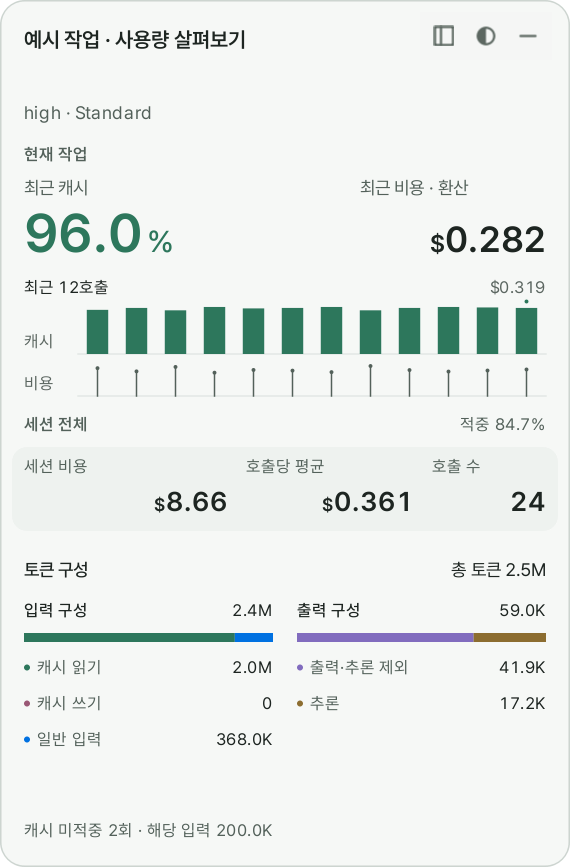

# CODEX·ON

[한국어](README.ko.md) · [English](README.md)

**Codexon compares requested model names with the model names recorded in server responses, and shows usage over your Codex window.**

- Inspect recorded request/response model-name differences and the calls behind them.
- See the latest call's tokens, cache rate, and API-equivalent cost in an overlay while working in Codex.
- Explore sessions and individual calls, including confirmed child-agent usage in session totals.
- Compare usage across models, reasoning efforts and service tiers, and inspect the calls behind each result.
- Follow remaining usage limits and reset times. The tray and taskbar widget keep them visible without opening the dashboard.

Costs are estimates using API prices; they are not your Codex bill. Model monitoring compares names recorded for a request and its response. Live limit checks use the installed Codex app-server and require an available account connection.

Supported installation target: **Windows 10/11 x64**. Setup includes Python, Qt and the independent connection recovery tool. Codexon can use your existing Codex account connection; no separate API key is required.

## Get started

**Setting up with an AI assistant?** Give it this repository link and ask it to follow the [AI / LLM installation guide](INSTALL.md). It will ask you to run Setup yourself. Tell it when installation is complete, and it will verify the installation, execution environment and settings.

1. Download `Codexon-Setup.exe` from [Releases](https://github.com/jisoq/Codexon/releases).
2. Run Setup. No administrator rights or separate Python installation are required.
3. Open **Codexon** from Start. Enable **Settings → General → Starts when you log in to Windows** if you want it available after login.

Codexon is distributed as an installer, with in-app updates, Start-menu shortcuts and uninstall support.

The dashboard reads local Codex records. If there are no records yet, use Codex first and refresh the dashboard. In **Settings → General → Language**, choose English or 한국어; the selection takes effect on the next launch. Closing the dashboard keeps Codexon in the tray. Use the tray's Exit action to stop it.

## Optional model monitoring

Enable **Settings → Proxy → Use proxy** to compare the requested and reported response model. Turning it on sends one verification call through your existing Codex account connection. Once setup succeeds, restart Codex to apply the connection change. Session history, cost analysis and usage-limit views can be used without the proxy.

Codexon reports a model match or mismatch only when completed request/response evidence can be linked reliably. Missing or conflicting evidence is not treated as a mismatch. The reported model name does not prove which hardware or internal model implementation handled the request.

### Proxy latency overhead

In the supplied measurements, median proxy overhead was **0.16ms** for a 4KB WebSocket request and **0.88ms** for 256KB. At 20MB, median overhead was **70.91ms** over WebSocket and **40.12ms** over HTTP/SSE.

| Request condition | Median added time | 95th percentile |
| --- | ---: | ---: |
| WebSocket 4KB | 0.16ms | 0.28ms |
| WebSocket 256KB | 0.88ms | 1.22ms |
| WebSocket 2MB | 8.39ms | 12.92ms |
| WebSocket 20MB | 70.91ms | 95.09ms |
| HTTP/SSE 20MB | 40.12ms | 65.63ms |

These figures describe time added by the proxy, not total response time or model generation time. Overhead is not zero and can vary with the environment and transfer size.

## Updates and recovery

Use **Settings → About and troubleshooting → Check and install updates**. For connection problems, open **Codexon Connection Recovery** from Start. See the [user guide](docs/user-guide.md) for record preservation, recovery and removal.

## Local data and removal

Codexon stores its usage index and quota history under `%LOCALAPPDATA%\CacheMonitor`, and model evidence, proxy state and configuration backups under `%USERPROFILE%\.cachemonitor\model-observer`. The older internal names are retained for compatibility. Updating or removing the program does not erase these records.

Use **Windows Settings → Apps → Installed apps → Codexon → Uninstall**. Removal restores the managed connection setting and defers deletion if app components are still in use. Configuration backups can contain sensitive values; do not attach them or unredacted records to bug reports. See the [user guide](docs/user-guide.md) for data handling and recovery details.

[Development](CONTRIBUTING.md) covers building and testing. [Security reporting](SECURITY.md) · [License](LICENSE) · [Third-party notices](THIRD-PARTY-NOTICES.md).

Codexon uses the custom **Codexon Attribution License 1.0**. Use, modification, and redistribution are permitted while preserving the original author **jisoq** and the original repository **https://github.com/jisoq/Codexon**, including their attribution in distributed graphical interfaces. See [LICENSE](LICENSE) for the full terms; third-party components retain their own licenses.
