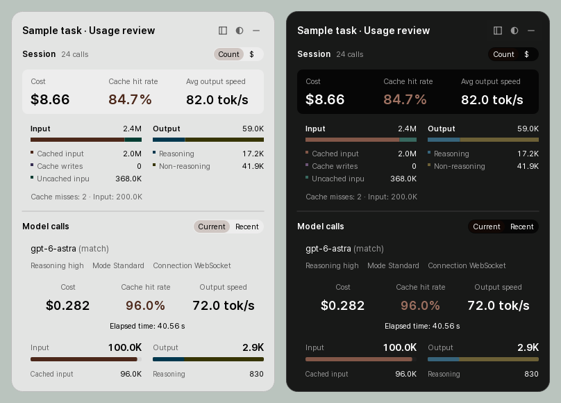
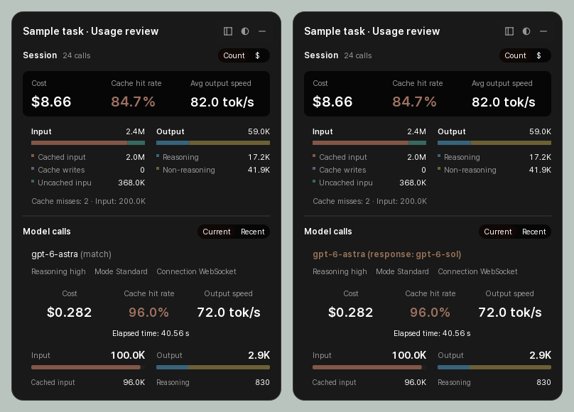
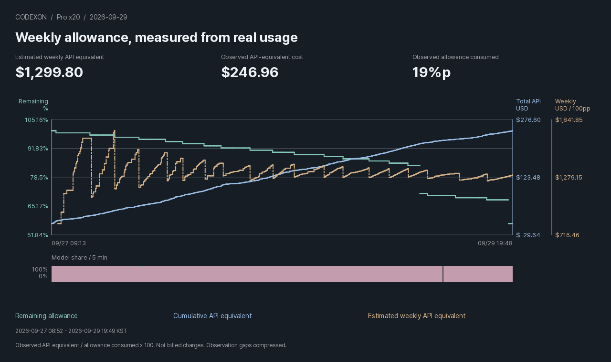
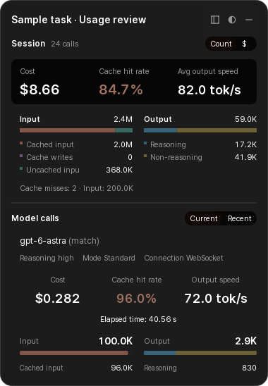
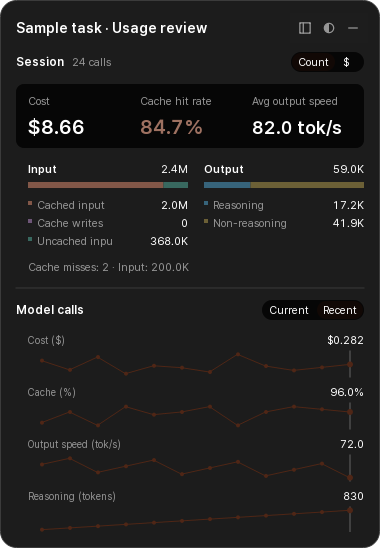
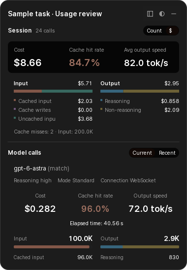
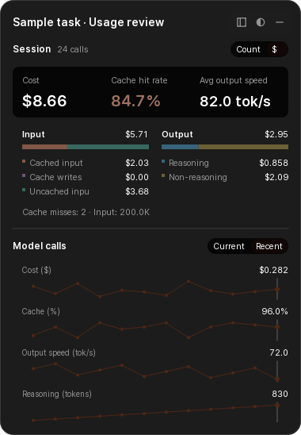
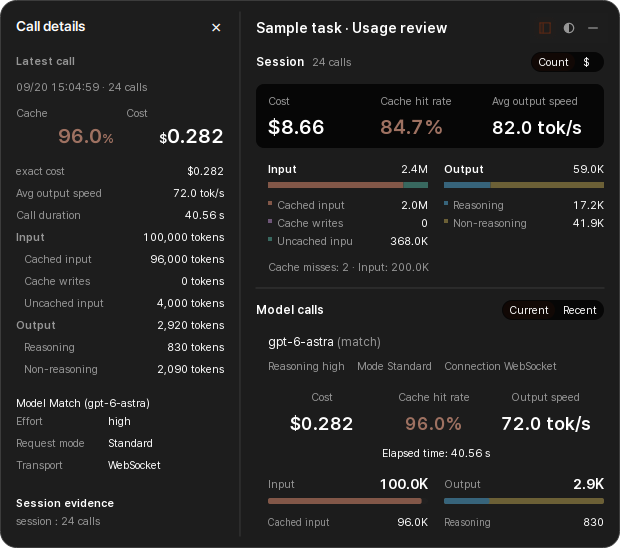

# CODEX·ON

[한국어](README.ko.md) · [English](README.md)

**Codexon is a Windows app for analyzing Codex usage and cache behavior, comparing request/response model names. Its overlay keeps usage visible over your Codex window while you work.**

Light and dark themes, rendered from the same sample session.

- **Spot a request/response model mismatch directly in the overlay.** Compare the requested and reported model names when investigating routing behavior.
- See the latest call's tokens, cache rate, and subscription value estimate in an overlay while working in Codex.
- Explore sessions and individual calls, including confirmed child-agent usage in session totals.
- Compare usage across models, reasoning efforts and service tiers, and inspect the calls behind each result.
- Follow remaining usage limits and reset times. The tray and taskbar widget keep them visible without opening the dashboard.

Amounts estimate subscription value using Standard base token rates and a 2.5x Fast usage multiplier; they are not billed charges. [Conversion basis](https://learn.chatgpt.com/docs/agent-configuration/speed). Model monitoring compares names recorded for a request and its response. Live limit checks use the installed Codex app-server and require an available account connection.

Supported installation target: **Windows 10/11 x64**. Setup includes Python, Qt and the independent connection recovery tool. Codexon can use your existing Codex account connection; no separate API key is required.

## Requested one model, got a different name back?

**Check the requested model against the model reported in the response, right in the overlay.** A mismatch highlights the line and shows the response model, such as `(response: gpt-6-sol)`. Matching names display `(match)` beside the requested model.

Use the difference as a clue when investigating routing behavior, then open **Call details** to inspect that call's record. These are recorded request/response names; they do not establish the internal routing path or underlying model implementation. The image above uses synthetic data to demonstrate the mismatch display.

## Weekly allowance, measured from real usage

**Historical example: the September 29 Pro x20 weekly allowance estimate was about $1,300 under the previous conversion policy.**

This image and its amounts use the previous API-rate conversion policy, before the subscription Fast 2.5x change. Rendered with the app's chart renderer from real local records as of **September 29, 2026, 19:49 KST**. Locally observed intervals in the current cycle account for **$246.96** in value under the previous conversion policy and **19 percentage points** of allowance consumed, yielding **$1,299.80** when extrapolated to a full weekly allowance. Account-wide remaining allowance and locally observed consumption cover different scopes; observation gaps are compressed in the chart.

## Overlay views

Switch **Count / $** to see the session's token composition or subscription value estimate composition. Switch **Current / Recent** to see the latest confirmed call or trends across the 12 most recent calls. The session totals stay visible above both views.

| Current call | Recent calls |
| --- | --- |
| **Token counts**  | **Token counts**  |
| **subscription value estimate**  | **subscription value estimate**  |

Open an image to inspect it at full size.

Use **Open details** in the header to open the overlay's call details. In the recent-call view, select a graph point first to inspect that call. Select **Call details** in the detail panel to open the full dashboard record.

The header controls adjust background transparency and minimize the overlay; select the minimized icon to restore it. Overlay images use synthetic sample data rendered by the app; existing captures precede the Fast 2.5x policy. Amounts use Standard base rates weighted by subscription usage: Fast is 2.5x Standard for the same tokens. Model comparison reflects recorded request/response names.

## Get started

**Setting up with an AI assistant?** Give it this repository link and ask it to follow the [AI / LLM installation guide](INSTALL.md). It will ask you to run Setup yourself. Tell it when installation is complete, and it will verify the installation, execution environment and settings.

1. Download `Codexon-Setup.exe` from [Releases](https://github.com/jisoq/Codexon/releases).
2. Run Setup. No administrator rights or separate Python installation are required.
3. Open **Codexon** from Start. Enable **Settings → General → Starts when you log in to Windows** if you want it available after login.

Codexon is distributed as an installer, with in-app updates, Start-menu shortcuts and uninstall support.

The dashboard reads local Codex records. If there are no records yet, use Codex first and refresh the dashboard. In **Settings → General → Language**, choose English or 한국어; the selection takes effect on the next launch. Closing the dashboard keeps Codexon in the tray. Use the tray's Exit action to stop it.

## Optional model monitoring

Enable **Settings → Codex integration → Proxy → Use proxy** to compare the requested and reported response model. Turning it on sends one verification call through your existing Codex account connection. Once setup succeeds, restart Codex to apply the connection change. Session history, cost analysis and usage-limit views can be used without the proxy.

Codexon reports a model match or mismatch only when completed request/response evidence can be linked reliably. Missing or conflicting evidence is not treated as a mismatch. The reported model name does not prove which hardware or internal model implementation handled the request.

### Proxy latency overhead

In the supplied measurements, median proxy overhead was **0.16ms** for a 4KB WebSocket request and **0.88ms** for 256KB. At 20MB, median overhead was **70.91ms** over WebSocket and **40.12ms** over HTTP/SSE.

| Request condition | Median added time | 95th percentile |
| --- | ---: | ---: |
| WebSocket 4KB | 0.16ms | 0.28ms |
| WebSocket 256KB | 0.88ms | 1.22ms |
| WebSocket 2MB | 8.39ms | 12.92ms |
| WebSocket 20MB | 70.91ms | 95.09ms |
| HTTP/SSE 20MB | 40.12ms | 65.63ms |

These figures describe time added by the proxy, not total response time or model generation time. Overhead is not zero and can vary with the environment and transfer size.

## Updates and recovery

Use **Settings → About → Check for updates**. For connection problems, open **Codexon Connection Recovery** from Start. See the [user guide](docs/user-guide.md) for record preservation, recovery and removal.

## Local data and removal

Codexon stores its usage index and quota history under `%LOCALAPPDATA%\CacheMonitor`, and model evidence, proxy state and configuration backups under `%USERPROFILE%\.cachemonitor\model-observer`. The older internal names are retained for compatibility. Updating or removing the program does not erase these records.

Use **Windows Settings → Apps → Installed apps → Codexon → Uninstall**. Removal restores the managed connection setting and defers deletion if app components are still in use. Configuration backups can contain sensitive values; do not attach them or unredacted records to bug reports. See the [user guide](docs/user-guide.md) for data handling and recovery details.

[Development](CONTRIBUTING.md) covers building and testing. [Security reporting](SECURITY.md) · [License](LICENSE) · [Third-party notices](THIRD-PARTY-NOTICES.md).

Codexon uses the custom **Codexon Attribution License 1.0**. Use, modification, and redistribution are permitted while preserving the original author **jisoq** and the original repository **https://github.com/jisoq/Codexon**, including their attribution in distributed graphical interfaces. See [LICENSE](LICENSE) for the full terms; third-party components retain their own licenses.
